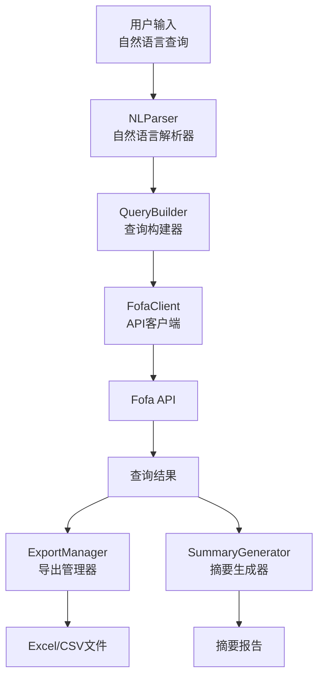
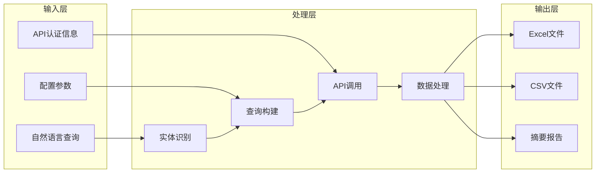

# Fofa 自然语言查询 Skill 设计文档

Feature Name: fofa-nl-query
Updated: 2025-03-28

## 描述

本 Skill 实现了一个自然语言到 Fofa 查询语法的转换系统，允许用户使用中文描述查询需求，系统自动解析、构建查询语句、调用 Fofa API、导出结果并生成摘要报告。

## 架构

### 系统架构图



### 数据流图



## 组件和接口

### 1. NLParser（自然语言解析器）

**职责**：将用户的自然语言查询解析为结构化的查询实体

**接口**：

```python
class NLParser:
    def parse(self, query: str) -> ParsedQuery
    def _extract_locations(self, query: str) -> List[QueryEntity]
    def _extract_services(self, query: str) -> List[QueryEntity]
    def _extract_ports(self, query: str) -> List[QueryEntity]
    def _extract_protocols(self, query: str) -> List[QueryEntity]
```

**关键实现**：

- 使用关键词映射表识别地理位置、服务类型、端口、协议
- 支持复合查询条件的识别
- 提取查询意图和数量限制

### 2. QueryBuilder（查询构建器）

**职责**：将解析后的实体转换为 Fofa 查询语法

**接口**：

```python
class QueryBuilder:
    def build(self, parsed_query: ParsedQuery, max_results: int) -> FofaQuery
    def _build_location_conditions(self, entities: List[QueryEntity]) -> List[str]
    def _build_service_conditions(self, entities: List[QueryEntity]) -> List[str]
    def explain_query(self, fofa_query: FofaQuery) -> str
```

**关键实现**：

- 根据实体类型选择合适的 Fofa 字段
- 使用逻辑运算符组合多个条件
- 生成查询语句的自然语言解释

### 3. FofaClient（API 客户端）

**职责**：处理与 Fofa API 的通信

**接口**：

```python
class FofaClient:
    def __init__(self, email: str, key: str)
    def search(self, query: str, fields: List[str], page: int, size: int) -> FofaResult
    def search_all(self, query: str, max_results: int) -> FofaResult
    def get_account_info(self) -> Dict[str, Any]
    def check_auth(self) -> bool
```

**关键实现**：

- Base64 编码查询语句
- 自动分页获取大量结果
- 错误处理和重试机制

### 4. ExportManager（导出管理器）

**职责**：处理查询结果的导出

**接口**：

```python
class ExportManager:
    def __init__(self, output_dir: str)
    def export_excel(self, result: FofaResult, filename: str) -> str
    def export_csv(self, result: FofaResult, filename: str) -> str
    def export_both(self, result: FofaResult, base_filename: str) -> Dict[str, str]
```

**关键实现**：

- 使用 openpyxl 生成格式化的 Excel 文件
- 使用 pandas 处理 CSV 导出
- 自动调整列宽和样式

### 5. SummaryGenerator（摘要生成器）

**职责**：生成查询结果的统计摘要

**接口**：

```python
class SummaryGenerator:
    def generate(self, result: FofaResult, natural_query: str) -> str
    def generate_markdown(self, result: FofaResult, natural_query: str) -> str
    def _generate_geo_stats(self, result: FofaResult) -> List[str]
    def _generate_service_stats(self, result: FofaResult) -> List[str]
```

**关键实现**：

- 使用 Counter 进行统计分析
- 生成文本和 Markdown 两种格式
- 识别安全风险并提供提示

## 数据模型

### ParsedQuery

```python
@dataclass
class ParsedQuery:
    raw_query: str          # 原始查询
    entities: List[QueryEntity]  # 识别的实体
    intent: str            # 查询意图
    constraints: Dict[str, Any]  # 约束条件
```

### QueryEntity

```python
@dataclass
class QueryEntity:
    entity_type: str       # 实体类型：location, service, port, protocol
    value: str            # 实体值
    raw_text: str         # 原始文本
    confidence: float     # 置信度
```

### FofaQuery

```python
@dataclass
class FofaQuery:
    query_string: str     # Fofa 查询语句
    fields: List[str]     # 返回字段
    page: int            # 页码
    size: int            # 每页大小
    full: bool           # 是否完整模式
```

### FofaResult

```python
@dataclass
class FofaResult:
    mode: str                    # 查询模式
    page: int                    # 当前页
    size: int                    # 结果数量
    total: int                   # 总数
    results: List[Dict[str, Any]] # 结果列表
    fields: List[str]            # 字段列表
    query: str                   # 查询语句
```

## 正确性属性

### 1. 查询构建正确性

- **属性**：生成的 Fofa 查询语句必须准确反映用户的自然语言意图
- **验证**：通过 explain_query 方法验证查询解释与原始查询一致

### 2. 数据完整性

- **属性**：导出的 Excel/CSV 文件必须包含所有返回的字段和数据
- **验证**：对比 API 返回结果和导出文件内容

### 3. 认证有效性

- **属性**：在使用 API 前必须验证认证信息有效
- **验证**：调用 check_auth 方法验证 email 和 key

### 4. 错误处理

- **属性**：所有外部调用（API、文件操作）必须有错误处理
- **验证**：通过异常捕获和友好的错误消息实现

## 错误处理

### API 错误

| 错误类型 | 处理策略 |
|---------|---------|
| 认证失败 | 提示用户检查 email 和 key |
| 查询超时 | 提示检查网络连接，支持重试 |
| 频率限制 | 提示等待后重试 |
| 无效查询 | 返回原始错误信息 |

### 文件操作错误

| 错误类型 | 处理策略 |
|---------|---------|
| 目录不存在 | 自动创建目录 |
| 权限不足 | 提示用户检查权限 |
| 磁盘空间不足 | 提示清理空间 |

### 解析错误

| 错误类型 | 处理策略 |
|---------|---------|
| 无法识别实体 | 使用原始查询作为全文搜索 |
| 实体冲突 | 使用最后识别的实体值 |

## 测试策略

### 单元测试

1. **NLParser 测试**
   - 测试各种自然语言查询的解析
   - 测试实体识别的准确性
   - 测试边界条件（空查询、无效查询）

2. **QueryBuilder 测试**
   - 测试查询语句构建的正确性
   - 测试多条件组合的逻辑
   - 测试字段选择的正确性

3. **FofaClient 测试**
   - 测试 API 调用的正确性
   - 测试分页逻辑
   - 测试错误处理

4. **ExportManager 测试**
   - 测试 Excel 文件生成
   - 测试 CSV 文件生成
   - 测试文件格式正确性

5. **SummaryGenerator 测试**
   - 测试统计计算的准确性
   - 测试摘要格式

### 集成测试

1. **端到端测试**
   - 从自然语言输入到文件输出的完整流程
   - 使用模拟的 Fofa API 响应

2. **性能测试**
   - 大量数据的导出性能
   - 内存使用监控

## 部署说明

### 环境要求

- Python 3.8+
- pip 包管理器
- 网络访问权限（访问 Fofa API）

### 安装步骤

```bash
# 1. 安装依赖
pip install -r requirements.txt

# 2. 配置环境变量
export FOFA_EMAIL="your-email@example.com"
export FOFA_KEY="your-api-key"

# 3. 验证安装
python -m src.main --help
```

### 使用示例

```bash
# 基本查询
python -m src.main "查找广东地区的 OpenClaw 服务"

# 指定输出格式
python -m src.main "查找中国境内运行 Nginx 的 Web 服务器" --format both --max 200

# 交互模式
python -m src.main --interactive
```

## 安全考虑

1. **API Key 保护**
   - 使用环境变量存储敏感信息
   - 不在日志中输出 API Key
   - 支持 .env 文件配置

2. **数据安全**
   - 查询结果可能包含敏感信息
   - 建议妥善保管导出文件
   - 不在公共环境分享结果

3. **网络安全**
   - 使用 HTTPS 与 Fofa API 通信
   - 验证 SSL 证书
   - 设置合理的超时时间

## 扩展性设计

### 支持新的实体类型

1. 在 `NLParser` 中添加新的关键词映射
2. 在 `QueryBuilder` 中添加对应的字段映射
3. 更新测试用例

### 支持新的导出格式

1. 在 `ExportManager` 中添加新的导出方法
2. 实现格式转换逻辑
3. 更新命令行参数处理

### 支持新的 API 功能

1. 在 `FofaClient` 中添加新的 API 方法
2. 更新数据模型
3. 添加对应的命令行参数

## 参考资料

- Fofa API 文档：https://fofa.info/api
- Fofa 规则与指纹：https://fofa.info/library
- openpyxl 文档：https://openpyxl.readthedocs.io/
- pandas 文档：https://pandas.pydata.org/docs/
